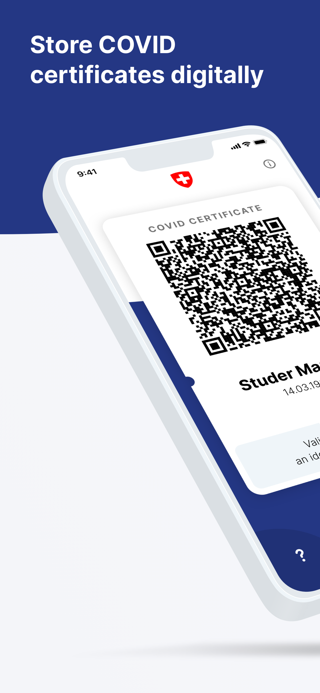
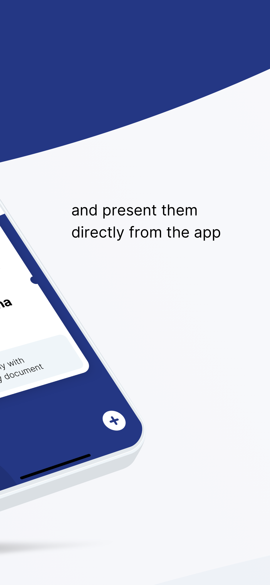
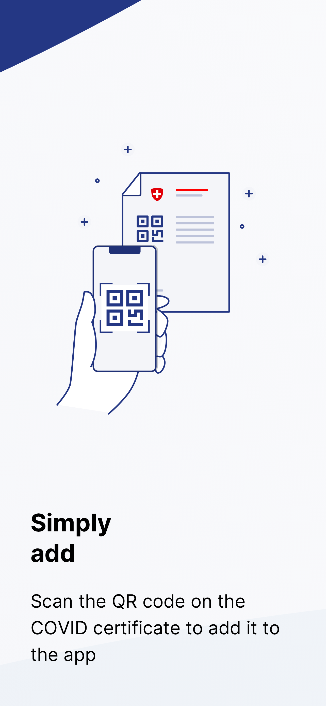
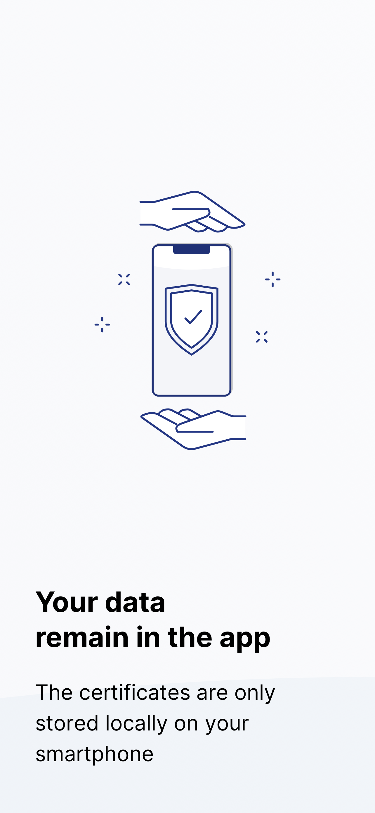
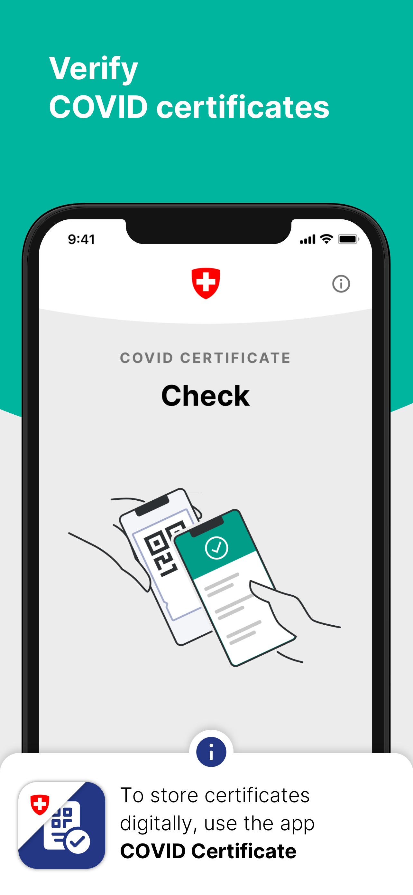
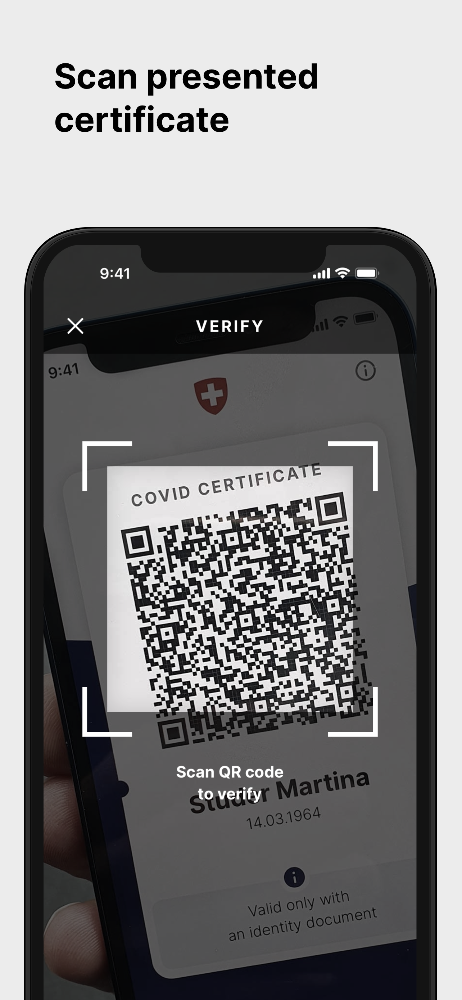
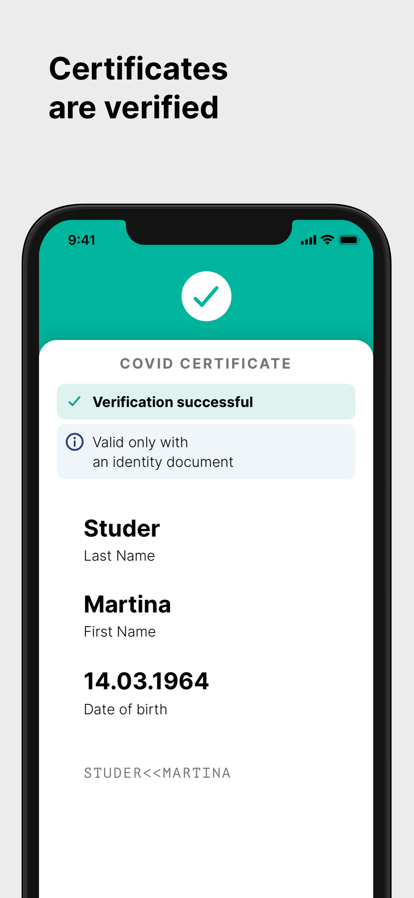

# COVID Certificate Apps - iOS

This project is released by the the [Federal Office of Information Technology, Systems and Telecommunication FOITT](https://www.bit.admin.ch/)
on behalf of the [Federal Office of Public Health FOPH](https://www.bag.admin.ch/).
The app design, UX and implementation was done by [Ubique](https://www.ubique.ch?app=github).

## COVID Certificate App

COVID Certificate is the official app for storing and presenting COVID certificates issued in Switzerland.
The certificates are kept and checked locally on the user's phone.

## COVID Certificate Check App

COVID Certificate Check is the official app for checking COVID certificates in Switzerland.
The validation is executed locally on the phone and no information of the scanned certificates is saved.

## Contribution Guide

This project is truly open-source and we welcome any feedback on the code regarding both the implementation and security aspects.

Bugs or potential problems should be reported using Github issues.
We welcome all pull requests that improve the quality of the source code.
Please note that the app will be available with approved translations in English, German, French, Italian.

## Repositories

* iOS App: [CovidCertificate-App-iOS](https://github.com/admin-ch/CovidCertificate-App-iOS)
* iOS SDK: [CovidCertificate-SDK-iOS](https://github.com/admin-ch/CovidCertificate-SDK-iOS)
* Android App: [CovidCertificate-App-Android](https://github.com/admin-ch/CovidCertificate-App-Android)
* For all others, see the [Github organisation](https://github.com/admin-ch/)

## Installation and Building

The project should be opened with the Xcode 12.5 or newer.
Dependencies are managed with [Swift Package Manager](https://swift.org/package-manager), no further setup is needed.

## License

This project is licensed under the terms of the MPL 2 license. See the [LICENSE](LICENSE) file for details.
